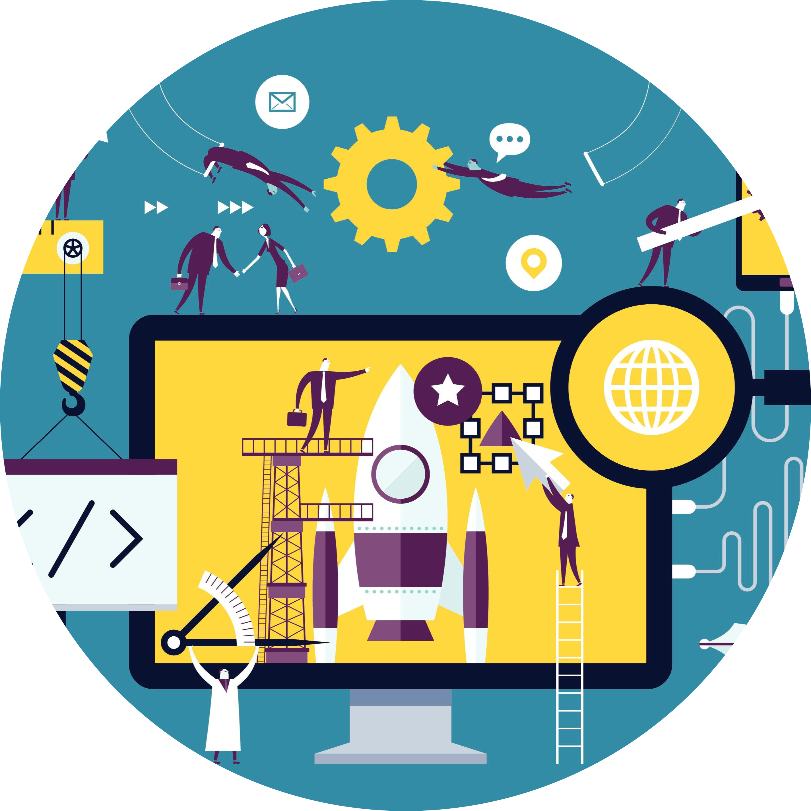

<html lang="en" dir="ltr">
  <head>
    <meta charset="utf-8">
    <title>Maryam Bagheri</title>
  <link rel="stylesheet" href="css/style.css">
  <link rel="icon" href="favicon.ico">
  <link href="https://fonts.googleapis.com/css2?family=Merriweather+Sans&family=Montserrat&family=Open+Sans&family=Roboto&family=Source+Sans+Pro&display=swap" rel="stylesheet">
  </head>
  <body>

  
  <h1>I am Maryam</h1>
  <h2 class="normal">a programer!</h2>
    
    

  

    
    <h2>Hello.</h2>
    
As a software engineer and a person worked in an educational area I have enough ability to manage multi-task and meet
      all deadlines.Strong problem-solving skills and ability to work individually or in a team. Fast learner, self-motivated,
      goal-oriented, interested in learning new concepts.

  

  

  

    <h2>My Skills.</h2>
    

      
      <h3>Front-end development</h3>
      
As a front-end web developer i can implemene visual and interactive elements that users engage with through their web browser when using a web application.

    

    

      
      <h3>Web Administrator</h3>
      
As a web administrator I can maintains the organization’s websites and  monitor the site traffic and performance further recommending changes to the site’s technical architecture.

    

  

  

  

    <h2>Get In Touch</h2>
    <h3>if you are big fan of programming as much as I do</h3>
    
Love programming as much as I do?Lets talk about it. We can drink a coffe and enjoy our conversation about Programming

  <a class="BUTTON_PCG" href="maryam.bagheri@concordia.ca" >Contact Me</a>

  

  <a class="footer-link" href="https://www.linkedin.com/in/maryam-bagheri-201861138/">LinkedIn</a>
    <a class="footer-link" href="https://www.linkedin.com/in/maryam-bagheri-201861138/">Website</a>
    <a class="footer-link" href="https://www.linkedin.com/in/maryam-bagheri-201861138/">Twitter</a>
  
© 2021 Maryam Bagheri@ The App brewery

  </body>
</html>
